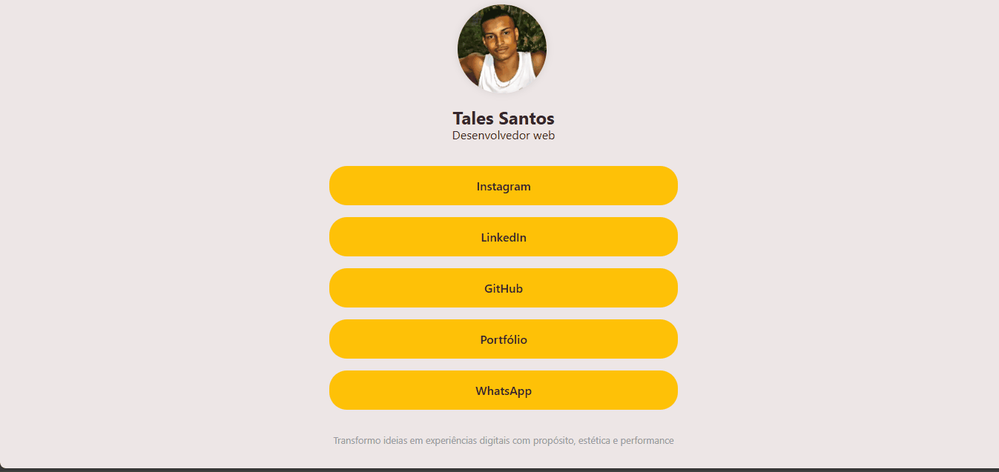

# Tales Santos - Linktree Pessoal (Vercel)

Este é um projeto de página pessoal estilo *Linktree*, desenvolvido como solução prática e estética para centralizar as redes sociais e contatos profissionais de **Tales Santos**.

## Visão geral

### Captura do projeto

### Links

* URL do site ativo: [🛜Acessa o projeto aqui💻](https://links-tales.vercel.app/)
* [Repositório do Painel de Controle](https://github.com/Tales-Santos7/meus-Links-painel)
* [Back-end (Render)](https://github.com/Tales-Santos7/Meus-Links-back)

## Sobre esse Projeto

• <strong>Personalizável</strong>: É possível editar os links apresentados diretamente por um painel de administração. 
• <strong>Painel de controle intuitivo</strong>: Fácil de gerir, permite adicionar, editar ou excluir links com simplicidade. 
• <strong>Responsivo</strong>: Perfeito para visualização em dispositivos móveis e desktop. 
• <strong>Design moderno</strong>: Visual limpo e atrativo com botões em destaque.

### Construído com

 
- HTML5   
- CSS3   
- JavaScript   
- Node.js   
- MongoDB  

## Outros

### Minhas redes sociais

 
   
   
   
   

